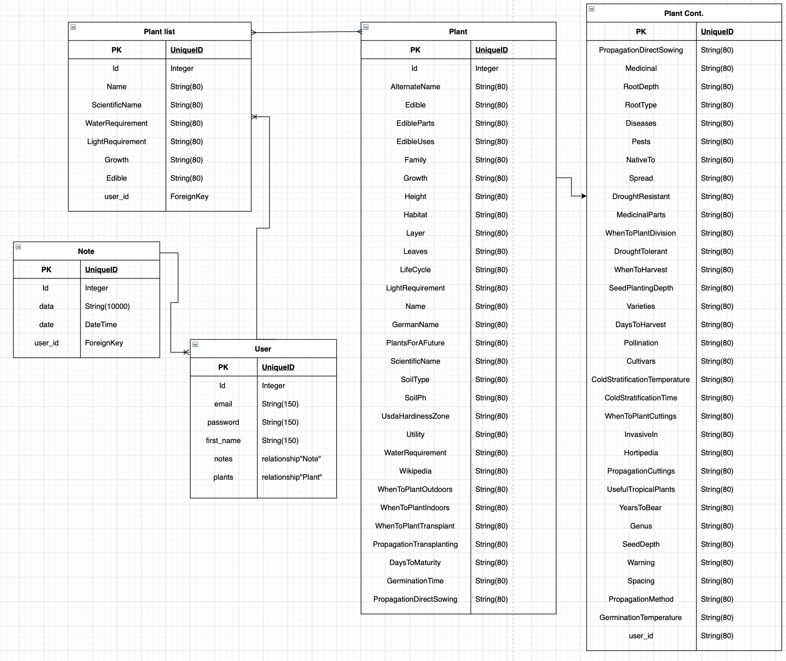

# Leaf It To Me
## Project - 4
### Tech Stack used
- Python 
- Flask 
- Jinja Templating Language & HTML Templates
- SQLAlchemy
- SQLite
# user stories
- new user: sign up
- authorize user: log in
- authorize user: search database
- authorize user: add note
- authorize user: remove note 
- authorize user: add a plant to a list *
- authorize user: remove a plant from list * 
<!-- 
- search database for specific plant by name/scientific name 
- add a plant to user's plant list with one to many relationship
- search for plant identification via submitting images and do an API call to Plant.ID
-->
# ERD


# Code Snippet

Since I was unable to find a working API for my data, I made the decision to code a utility that will help me scrape data from a particular plant database website(I did check their website and they do allow developers to use scraping tools to gather data from their database).

## Gathering data
### - Grab all routes

This code snippet will grab all the routes from a page by utilizing [BeautifulSoup](https://www.crummy.com/software/BeautifulSoup/) by selecting the `div` & `class` within the `html` page.

``` python

def scrape_for_all_plant_routes(link):
    page = requests.get(link)
    soup = BeautifulSoup(page.content, "html.parser")
    table = soup.find("tbody")
    plant_elements = table.find_all("div", class_="list-row-text")
    results = []
    for plant_elements in plant_elements:
        tag = plant_elements.find("a", href=True)
        save_list = tag["href"]
        results.append(save_list)
    return results
```

### - Grab data from specific route

Using a double `For loop`, this function will iterate through every link within the page and grab data from specific area within the `html element` by `class`. Once the Parent `div` have been identify it will then travel down to the children element to grab the keys and value needed for my dataset. 

The second `For loop` will iterate through every single element to separate them into keys and values to use for the dataset. Once this process is complete, the data is then return data to the empty `{}` to be use for the next process.

``` python
def scrape_plant_details(routes):
    data: Plants = {}
    for route in routes:
        plant_url = f"https://permapeople.org{route}"
        response = requests.get(plant_url)
        page = BeautifulSoup(response.content, "html.parser")
        detail_box = page.find(class_="layout-grid")
        name_box = page.find(class_="data-primary")
        sci_name_box = name_box.em
        plant_attributes = detail_box.find_all("div", class_="data-set")
        name = str.strip(name_box.contents[0])
        sci_name = sci_name_box.text
        details = {"Name": f"{name}", "ScientificName": f"{sci_name}"}
        for attributes in plant_attributes:
            data_key = attributes.find("label", class_="data-key")
            key = format_column_name(data_key.text)
            value = attributes.find("span", class_="data-value").text
            details[str.strip(key)] = str.strip(value)
        data[route] = details
    return data
```

### - Format column name

The data that is return have a lot of spaces between them along with a few random "Help" messages that didn't play well with SQL database. So the code snippet bellow will remove the word "Help", capitalize the first letter of the word and remove all spacing between all the words. This will allow the column name to be in CamelCase.

``` python
def format_column_name(name):
    arr = name.split()
    arr = [word.capitalize() for word in arr if word != "Help"]
    col = "".join(arr)
    return col
```

### - Grab data from all pages & save it as a json file

This last portion of the code will go through all the page set within the parameters, grab all relevant information & format the data in a way that a human can read it. I implemented a progress bar within the `For loop` to see how long it'll take for the task to be completed.

``` python
def scrape_all_pages(start: int, end: int, filename: str):
    base_uri = "https://permapeople.org/search?sort=name_asc"
    main_dictionary = {}
    with open(filename, "wb") as f:
        for i in tqdm(range(start, end + 1)):
            pagination_uri = base_uri + f"&page={i}"
            routes = scrape_for_all_plant_routes(pagination_uri)
            plants = scrape_plant_details(routes)
            main_dictionary = {**main_dictionary, **plants}
        json.dump(
            main_dictionary,
            codecs.getwriter("utf-8")(f),
            sort_keys=True,
            indent=4,
            ensure_ascii=False,
        )

if __name__ == "__main__":
    scrape_all_pages(1, 427, "test_scrape_dump.json")

```
Once the `scrape_utils.py` is run it will take 55 minutes and 28 second to grab 427 pages worth of data from this website. Once completed, there will be a total of 8525 items and it will be displaying the data in the following format.

``` json
"/plants/acrocarpus-fraxinifolius-pink-cedar": {
        "AlternateName": "Shingle tree, It is also known as indian ash, Australian ash, Kenya coffeeshade, Mundani (bengali), Red cedar other names include: mayahnin, Yetama (burmese); kuranjan(french); belanji, Hevulige, Kuranjan, Malankommao, Silchhal (hindi); madang pariek, Delimas (indonesian); delimas (javanese); khan khak, Ket ?hoy (lao); lazcar, Cedro rosado (spanish); khang chang, Sadao chang, Khang khi mot (thai); trade name: mundani",
        "Family": "Fabaceae",
        "Growth": "Fast",
        "Height": "30.0",
        "Layer": "Tall trees",
        "LightRequirement": "Full sun",
        "Name": "Pink Cedar",
        "PlantsForAFuture": "Https://pfaf.org/user/plant.aspx?latinname=acrocarpus fraxinifolius",
        "ScientificName": "Acrocarpus fraxinifolius",
        "SoilType": "Medium",
        "UsdaHardinessZone": "10-12",
        "WaterRequirement": "Moist"
    },
    "/plants/escontria-chiotilla-chiotilla": {
        "AlternateName": "Jiotilla, Quiotilla, Chiotilla cactus, Geotilla fruit, Tuna fruit",
        "Edible": "True",
        "EdibleParts": "Fruit",
        "Family": "Cactaceae",
        "Growth": "Medium",
        "Height": "7.0",
        "LifeCycle": "Perennial",
        "LightRequirement": "Full sun, Partial sun/shade",
        "Name": "Chiotilla",
        "PlantsForAFuture": "Https://pfaf.org/user/plant.aspx?latinname=escontria chiotilla",
        "ScientificName": "Escontria chiotilla",
        "SoilType": "Light (sandy), Medium, Heavy (clay)",
        "UsdaHardinessZone": "9-11",
        "WaterRequirement": "Dry, Moist"

```
 
## Seed the database

`add_plants()` will get call when the app initialize. This will proceed to run the command and seed the database. the `add_plants()` will be comment out once the database is seeded.

``` python
#locate in __init__.py
@click.command()
@click.option('--filename', default="seed.json", help='Filename for the json file to be used for seeding the db')
def add_plants(filename):
    """
    Migrate plants in seed file to database
    """
    click.echo('Adding plants to db...')
    from .models import Plant

    count = 0
    with open(filename) as f:
        data = json.load(f)
        plants = [Plant(**p) for p in data.values()]
        count = len(plants)
        db.session.add_all(plants)
        db.session.commit()
    return click.echo(f'{count} plants were added successfully to the database.')

#locate in main.py
if __name__ == "__main__":
    add_plants()
    app.run(debug=True)

```
## Display all Plants within database

This sample code will allow the user to view all plants that is currently in the database. 

``` python
@views.route("/plants", methods=["GET"])
@login_required
def all_plants():
    results = db.session.query(Plant)
    plant_list = []
    for result in results:
        plant = {
            "id": result.id,
            "Name": result.Name,
            "Growth": result.Growth,
            "ScientificName": result.ScientificName,
            "LightRequirement": result.LightRequirement,
            "SoilType": result.SoilType,
            "WaterRequirement": result.WaterRequirement,
            "Wikipedia": result.Wikipedia,
            "Edible": result.Edible,
            "EdibleParts": result.EdibleParts,
            "Family": result.Family,
            "LifeCycle": result.LifeCycle,
        }
        plant_list.append(plant)

    return render_template("plant.html", user=current_user, plant_list=plant_list)
```

## Model sample
Sample of the plant model scrape from the website.
``` python
class Plant(db.Model):
    id = db.Column(db.Integer, primary_key=True)
    AlternateName = db.Column(db.String(80), nullable=True, default=None)
    Edible = db.Column(db.String(80), nullable=True, default=None)
    EdibleParts = db.Column(db.String(80), nullable=True, default=None)
    EdibleUses = db.Column(db.String(80), nullable=True, default=None)
    Family = db.Column(db.String(80))
    Growth = db.Column(db.String(10), nullable=True, default=None)
    Height = db.Column(db.String(80))
    Habitat = db.Column(db.String(80), nullable=True, default=None)
    Layer = db.Column(db.String(80), nullable=True, default=None)
    Leaves = db.Column(db.String(80), nullable=True, default=None)
    LifeCycle = db.Column(db.String(80), nullable=True, default=None)
    LightRequirement = db.Column(db.String(80))
    Name = db.Column(db.String(80))
    GermanName = db.Column(db.String(80), nullable=True, default=None)
    PlantsForAFuture = db.Column(db.String(80))
    ScientificName = db.Column(db.String(80))
    SoilType = db.Column(db.String(80))
    SoilPh = db.Column(db.String(80), nullable=True, default=None)
    UsdaHardinessZone = db.Column(db.String(80))
    Utility = db.Column(db.String(80), nullable=True, default=None)
    WaterRequirement = db.Column(db.String(80))
    Wikipedia = db.Column(db.String(80))
    WhenToPlantOutdoors = db.Column(db.String(80), nullable=True, default=None)
    WhenToPlantIndoors = db.Column(db.String(80), nullable=True, default=None)
    WhenToPlantTransplant = db.Column(db.String(80), nullable=True, default=None)
    PropagationTransplanting = db.Column(db.String(80), nullable=True, default=None)
    DaysToMaturity = db.Column(db.String(80), nullable=True, default=None)
    GerminationTime = db.Column(db.String(80), nullable=True, default=None)
    PropagationDirectSowing = db.Column(db.String(80), nullable=True, default=None)
    Medicinal = db.Column(db.String(80), nullable=True, default=None)
    RootDepth = db.Column(db.String(80), nullable=True, default=None)
    RootType = db.Column(db.String(80), nullable=True, default=None)
    Diseases = db.Column(db.String(80), nullable=True, default=None)
    Pests = db.Column(db.String(80), nullable=True, default=None)
    NativeTo = db.Column(db.String(80), nullable=True, default=None)
    Spread = db.Column(db.String(80), nullable=True, default=None)
    DroughtResistant = db.Column(db.String(80), nullable=True, default=None)
    MedicinalParts = db.Column(db.String(80), nullable=True, default=None)
    WhenToPlantDivision = db.Column(db.String(80), nullable=True, default=None)
    DroughtTolerant = db.Column(db.String(80), nullable=True, default=None)
    WhenToHarvest = db.Column(db.String(80), nullable=True, default=None)
    SeedPlantingDepth = db.Column(db.String(80), nullable=True, default=None)
    Varieties = db.Column(db.String(80), nullable=True, default=None)
    DaysToHarvest = db.Column(db.String(80), nullable=True, default=None)
    Pollination = db.Column(db.String(80), nullable=True, default=None)
    Cultivars = db.Column(db.String(80), nullable=True, default=None)
    ColdStratificationTemperature = db.Column(db.String(80), nullable=True, default=None)
    ColdStratificationTime= db.Column(db.String(80), nullable=True, default=None)
    WhenToPlantCuttings = db.Column(db.String(80), nullable=True, default=None)
    InvasiveIn = db.Column(db.String(80), nullable=True, default=None)
    Hortipedia = db.Column(db.String(80), nullable=True, default=None)
    PropagationCuttings = db.Column(db.String(80), nullable=True, default=None)
    UsefulTropicalPlants = db.Column(db.String(80), nullable=True, default=None)
    YearsToBear = db.Column(db.String(80), nullable=True, default=None)
    Genus = db.Column(db.String(80), nullable=True, default=None)
    SeedDepth = db.Column(db.String(80), nullable=True, default=None)
    Warning = db.Column(db.String(80), nullable=True, default=None)
    Spacing = db.Column(db.String(80), nullable=True, default=None)
    PropagationMethod = db.Column(db.String(80), nullable=True, default=None)
    GerminationTemperature = db.Column(db.String(80), nullable=True, default=None)
    user_id = db.Column(db.Integer, db.ForeignKey("user.id"))
```